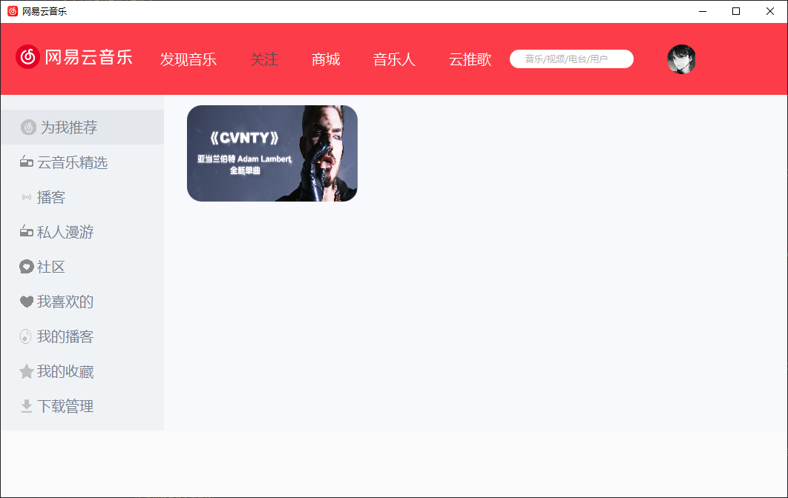

## JavaFX 模仿网易云PC客户端

#### 介绍

个人兴趣写着完练习桌面应用  
用JavaFX开发  
不定期继续完成

#### 安装教程

1.  安装 JDK 1.8  
    如果你是JDK11或更高版本需要下载javafx-sdk,然后手动添加```javafx-sdk/lib```的依赖到项目中。  
    因为从 Java 11 开始，JavaFX 不再包含在标准的 JDK 中。
2.  JavaFX Scene Builder 2.0 这个不是必须的，这个工具`Oracle`官方提供的可视化拖拽布局FXML页面工具
2.  将项目导入IDEA中
3.  运行 [NeteasecCloudStartApplication.java](src%2Fmain%2Fjava%2Forg%2Fsmog%2Fneteasecloud%2FNeteasecCloudStartApplication.java) 启动类

#### 效果展示

实现了`头部导航`和`左侧菜单`栏以及`轮播图`

1. 主页面



###### README编写编辑时间: 2024-06-23 13:29:20